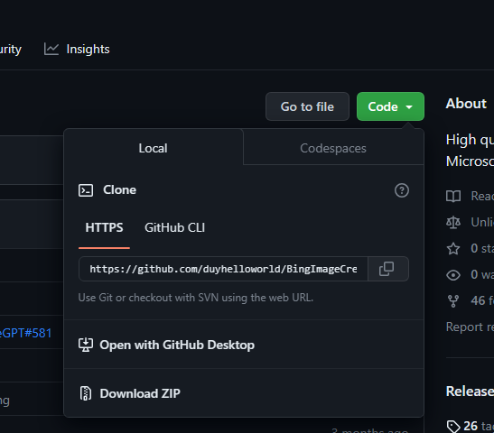
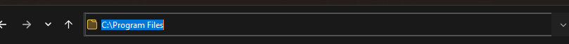
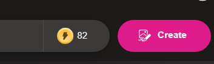
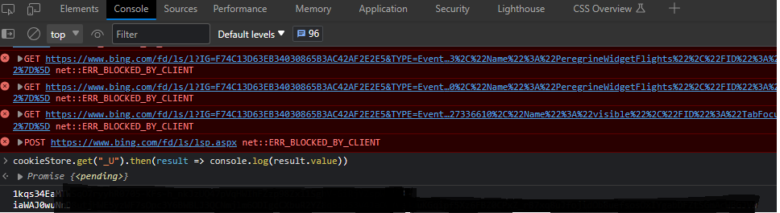
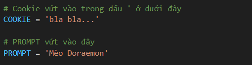
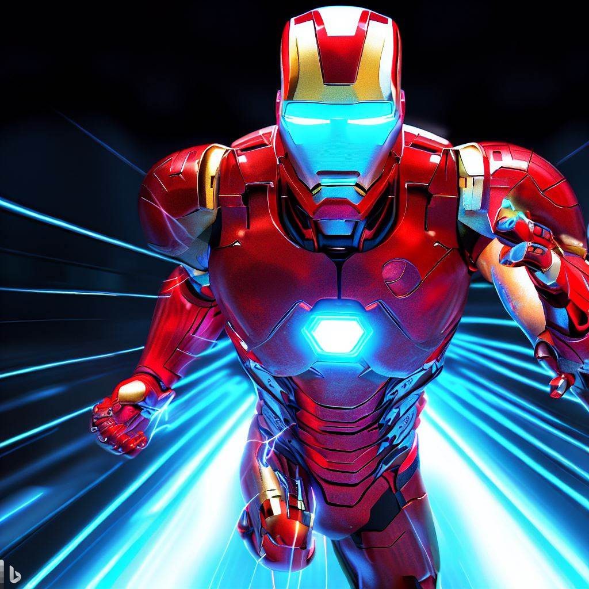
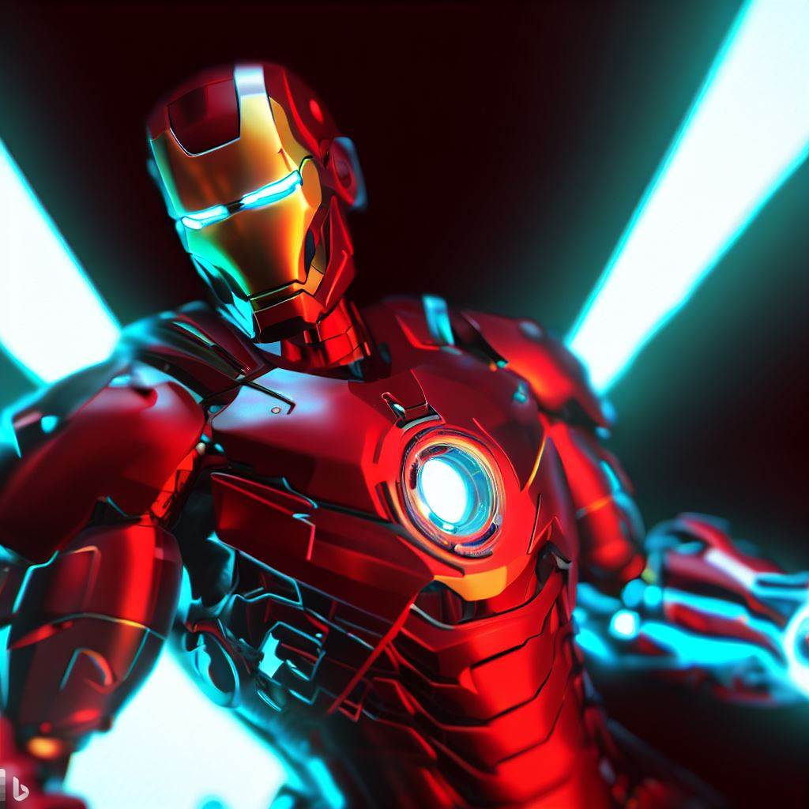

# BingImageCreator
Tool tạo ảnh từ Bing Dall-e

### Cài đặt môi trường
  - Python >= 3.8 [Tải ở đây](https://www.python.org/downloads/)
  - [__Visual Studio Code__](https://code.visualstudio.com/) (để lập trình) 
    hoặc 
    __Terminal trong máy (Command Prompt hoặc PowerShel)__ (để sử dụng)

### Tải bộ code 
  - Tải qua link [Github]("https://github.com/duyhelloworld/BingImageCreator")
    (Mở trang, tìm nút như ảnh)
    
  - Download zip và giải nén ra 1 folder bất kì (Nhớ lấy đừơng dẫn tới đó)
  (Có thể copy phần đường dẫn như sau)
  

Đến đây, bạn có thể chọn hướng sử dụng : lập trình để ứng dụng hoặc sủ dụng ngay

## Đối với Sử dụng ngay

### Cài thư viện
  - Bấm tổ hợp __Window__ + __R__
  - Gõ __cmd__ hoặc __wt__ để mở terminal
  - Gõ lệnh `cd ` + [Đường dẫn vừa copy ở trên]

    VD : cd C:\User\PC\Downloads\BingImageCreator 
  - Tải thư viện qua lệnh 

    `pip install -r requirements.txt`
  
    (Không đóng cửa số Terminal này vì sẽ sử dụng sau)

_______
### Đăng nhập MS Bing
- Cần đăng nhập tài khoản Microsoft trước để có thể lấy xác thực (thông qua bất cứ trình duyệt nào)
- Kiểm tra đã đăng nhập tại [đây](https://www.bing.com/images/create)
  - Nếu trả về trang tạo ảnh thành công, kiểm tra số credit hiện tại

      

    (Mặc định Bing sẽ cho free 100 credit / ngày / tài khoản)

  - Nếu không, hãy [đăng nhập](https://login.microsoftonline.com/) / tạo tài khoản microsoft và check lại

________
### Lấy cookies

#### Trình duyệt Edge, Opera, Chrome
- Mở trang https://bing.com/.
- __F12__ hoặc __Ctrl__ + __Shift__ + __I__ để mở devtool
- Tìm tới tab Console, dán lệnh `cookieStore.get("_U").then(result => console.log(result.value))` và bấm __Enter__   
- Copy kết quả 

#### Firefox
- Vào trang https://bing.com/.
- __F12__ mở devtool
- Sang tab `Storage`
- Mở rộng tab `Cookies`
- Click vào `https://bing.com` cookie
- copy giá trị của `_U`

### Gắn xác thực và sử dụng app
 - Dùng Notepad hoặc editor bất kì, mở file main.py trong bộ code
  (Đường dẫn : [bộ code]/src/main.py)
  - Dán cookie vừa sao chép vào dòng chỉ định
  - Thay thế câu prompt với hình ảnh muốn tạo
  
  - Sử dụng lại cửa sổ terminal ở trên, dán lệnh
  
    `python src/main.py`
  - Chờ đợi kết quả. Khi dòng lệnh trên chạy xong, hãy vào folder `src/images` để xem ảnh vừa tạo

## Đối với Lập trình:
  - Mở Visual Studio Code
  - Open Folder, mở vị trí lưu bộ code
  - Bấm tổ hợp phím __Ctrl__ + __`__ để mở terminal
  - Cài thư viện bằng cách paste lệnh sau vào terminal

    `pip install -r requirements.txt`

    (các bước khác tương tự. Riêng bước chạy lệnh sử dụng app, có thể tận dụng cửa số Terminal vừa dùng để chạy)
    
    [Link repo gốc để tìm hiểu](https://github.com/acheong08/BingImageCreator)

  1 vài sản phẩm của tôi: 
  | ||
  |-|-|
  | | 

